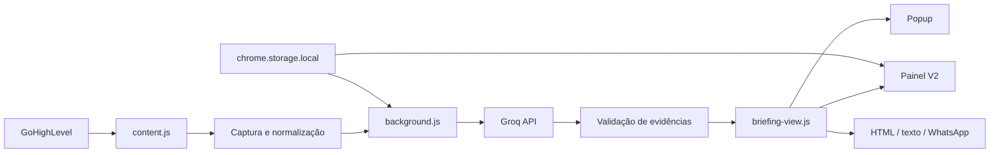

# HOD Briefing V2

> Extensão Chrome open source que transforma conversas e dados do GoHighLevel em briefings estruturados para reuniões comerciais.

[](manifest.json)
[](https://groq.com/)
[](CHANGELOG.md)
[](LICENSE)

O HOD Briefing V2 captura o contexto disponível no CRM, separa evidências úteis de ruído operacional e gera um handoff claro para o mentor responsável pela consultoria. O projeto combina captura de histórico virtualizado, dados do perfil do lead, geração estruturada por IA, edição, validação e cópia rica.

## Recursos

- Captura de conversas no GoHighLevel e LeadConnector.
- Suporte aos fluxos de WhatsApp e Instagram.
- Leitura de campos disponíveis no perfil do lead.
- Deduplicação de mensagens por identificadores estáveis quando disponíveis.
- Varredura de histórico virtualizado com restauração da posição.
- Geração com GPT-OSS 120B através da Groq.
- Saída estruturada e validação baseada em evidências.
- Editor, regeneração e pré-visualização.
- Formatos HTML para GHL, texto e WhatsApp.
- Histórico local opcional de briefings.
- Diagnóstico de captura sem consumir IA.
- Teste de conexão com a Groq usando dados fictícios.
- Painel flutuante V2 e popup com Briefing, Histórico e Configurações.
- Temas e preferências de movimento.

## Arquitetura



O HOD Briefing é independente do backend e do banco do HOD Hub. A extensão captura informações no CRM e o service worker chama a Groq diretamente.

## Estrutura

```text
hod-briefing/
├── manifest.json            # Manifest V3 e permissões
├── background.js            # provedor de IA, retry e validação
├── content.js               # captura, normalização e composição
├── settings.js              # preferências e armazenamento local
├── briefing-view.js         # apresentação compartilhada do briefing
├── v2-ui.js                 # comportamento do painel V2
├── v2-content.css           # interface injetada no CRM
├── popup.html               # popup da extensão
├── popup.js                 # navegação e configurações
├── briefing.md              # contrato editorial da geração
├── icons/                   # identidade visual
├── tests/                   # regressão, provedor e central
└── docs/                    # documentação aprofundada
```

## Instalação

1. Clone ou baixe o repositório.
2. Abra `chrome://extensions`.
3. Ative **Modo do desenvolvedor**.
4. Clique em **Carregar sem compactação**.
5. Selecione a pasta deste repositório.
6. Abra o popup, configure uma chave da Groq e teste a conexão.
7. Recarregue a página do CRM.

Não mantenha duas versões da extensão ativas na mesma página.

## Configuração de IA

- Provedor atual: Groq Cloud.
- Modelo atual: GPT-OSS 120B.
- A chave é salva em `chrome.storage.local` e não pertence ao código.
- Perfis controlam timeout e novas tentativas em falhas transitórias.
- O teste de conexão utiliza um personagem fictício.

## WhatsApp e Instagram

No WhatsApp, o briefing pode usar o histórico e os campos reais do Perfil do GHL. No Instagram, prioriza momento atual, objetivo e fatos comprovados na conversa. Em ambos, ausência de dado não vira resposta negativa e informação financeira nunca deve ser inventada.

## Privacidade

- A chave da Groq fica no armazenamento local da extensão.
- E-mails, telefones, documentos e links são removidos antes do envio quando aplicável.
- Métricas locais não devem armazenar conversa nem chave.
- O histórico opcional pode conter dados pessoais e deve permanecer desativado quando não for necessário.
- Dados reais não devem entrar em issues, testes ou screenshots públicos.

Leia [PRIVACY.md](PRIVACY.md) e [SECURITY.md](SECURITY.md).

## Validação

```bash
node tests/regression.js
node tests/provider.test.js
node tests/central.test.js
node --check background.js
node --check content.js
node --check popup.js
node --check v2-ui.js
```

Testes locais não comprovam a pasta carregada no Chrome, a captura completa do histórico virtualizado, a geração real ou a colagem no editor do CRM. Consulte [docs/validation.md](docs/validation.md).

## Documentação

- [Arquitetura](docs/architecture.md)
- [Motor de captura](docs/capture-engine.md)
- [Motor de briefing](docs/briefing-engine.md)
- [Privacidade](PRIVACY.md)
- [Validação](docs/validation.md)
- [Roadmap](docs/roadmap.md)
- [Como contribuir](CONTRIBUTING.md)
- [Changelog](CHANGELOG.md)

## Estado atual

A V2 é a versão oficial em uso. O projeto está identificado como `2.0.1`, usa Manifest V3, painel flutuante próprio e visualização compartilhada entre popup e painel.

## Licença

Distribuído sob a licença [MIT](LICENSE).

